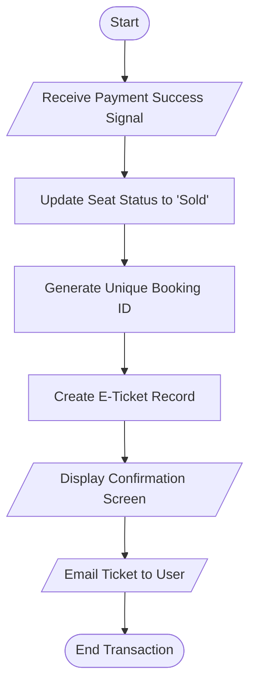

```mermaid
flowchart TD
    Start([Start]) --> Input1[/Receive Payment Success Signal/]
    Input1 --> Process1[Update Seat Status to 'Sold']
    Process1 --> Process2[Generate Unique Booking ID]
    Process2 --> Process3[Create E-Ticket Record]
    Process3 --> Output1[/Display Confirmation Screen/]
    Output1 --> Output2[/Email Ticket to User/]
    Output2 --> End([End Transaction])
```
