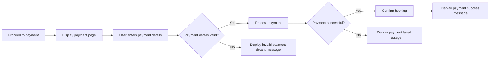

```mermaid
flowchart LR
    A[Proceed to payment] --> B[Display payment page]
    B --> C[User enters payment details]
    C --> D{Payment details valid?}
    D -- Yes --> E[Process payment]
    E --> F{Payment successful?}
    F -- Yes --> G[Confirm booking]
    G --> H[Display payment success message]
    F -- No --> I[Display payment failed message]
    D -- No --> J[Display invalid payment details message]
```
